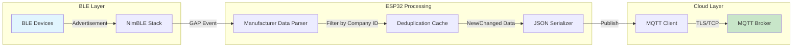
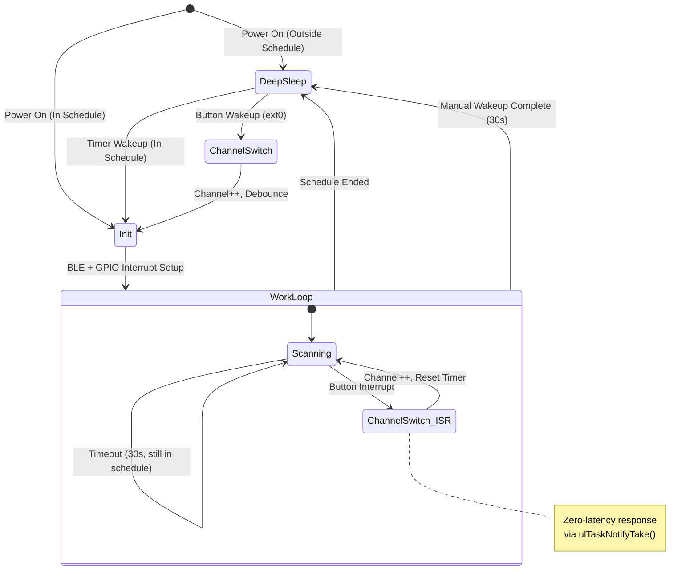
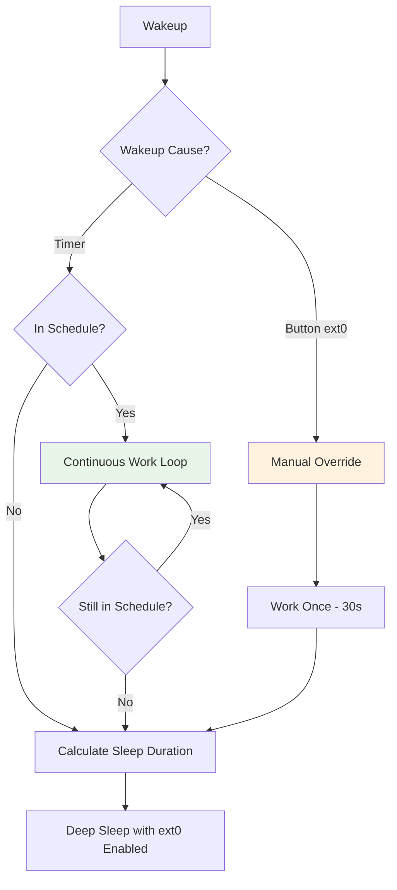
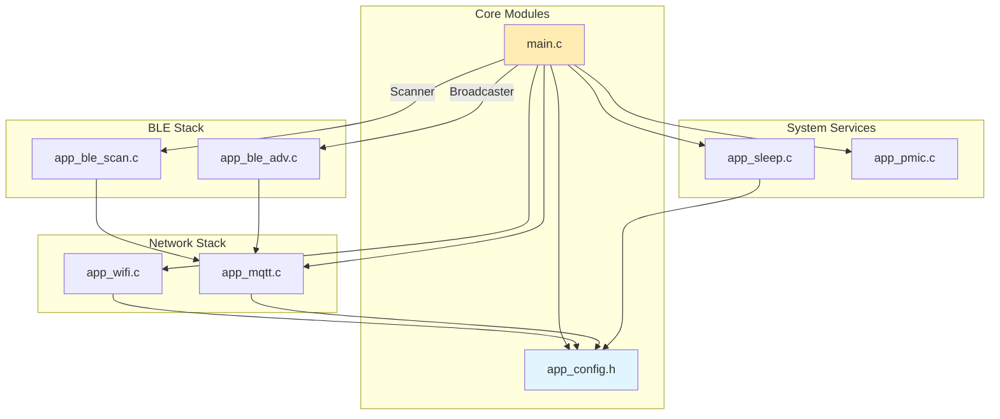

## High-Level Architecture

The gateway acts as a bridge between BLE devices and an MQTT broker. The Scanner mode captures BLE advertisements, deduplicates them, and publishes to the cloud.



### Data Flow Summary

1. **BLE Devices** broadcast advertisement packets containing manufacturer-specific data
2. **NimBLE Stack** triggers `BLE_GAP_EVENT_DISC` events for each discovered device
3. **Parser** extracts manufacturer data and filters by Company ID (0xFFFF)
4. **Deduplication Cache** (128 entries) compares MAC + payload to detect changes
5. **JSON Serializer** formats data: `{mac, rssi, payload (base64)}`
6. **MQTT Client** publishes to the current channel topic

---

## Core State Machine

The Scanner operates as a state machine with deep sleep integration. The key innovation is using **GPIO interrupts** instead of polling for instant channel switching.



### State Descriptions

| State | Trigger | Action |
|-------|---------|--------|
| **DeepSleep** | Schedule window closed | Minimal power consumption, ext0 wakeup enabled |
| **Init** | Timer/Button wakeup | WiFi → MQTT → SNTP sync → BLE init |
| **WorkLoop** | In schedule or manual trigger | Continuous scanning with interrupt support |
| **ChannelSwitch** | Button press (ISR or ext0) | Increment channel index, update MQTT topic |

---

## Key Engineering Decisions

### 1. Interrupt-Driven Interaction

**Problem**: The original polling approach required the CPU to actively wait during the 30-second scan cycle, wasting power and preventing instant response.

**Solution**: GPIO Interrupt + FreeRTOS Task Notification

```c
// ISR Handler (IRAM_ATTR for fast execution)
static void IRAM_ATTR gpio_isr_handler(void* arg) {
    // Software debounce (200ms)
    if ((now - last_press) < pdMS_TO_TICKS(200)) return;
    
    // Notify main task immediately
    vTaskNotifyGiveFromISR(s_main_task_handle, &xHigherPriorityTaskWoken);
}

// Main loop - waits for EITHER timeout OR button press
uint32_t notification = ulTaskNotifyTake(pdTRUE, pdMS_TO_TICKS(30000));

if (notification > 0) {
    // Button pressed - switch channel instantly
    g_current_channel_idx = (g_current_channel_idx + 1) % CHANNEL_COUNT;
}
```

**Benefits**:
- **Zero CPU usage** during wait (task is blocked, not spinning)
- **Instant response** to button press (< 1ms latency)
- **Clean code** - single wait point handles both timeout and interrupt

### 2. Smart Power Management

The system combines **schedule-based automation** with **manual override** capability.



**Schedule Logic**:
- `get_seconds_until_next_slot()` returns `0` if currently in work window
- Work window: Configurable hours (default 8:00-18:00)
- Tolerance: 5 minutes (300 seconds) for early wakeup

**Manual Override**:
- Button press during deep sleep → Wake, switch channel, work once (30s)
- Button press during work → Instant channel switch, reset 30s timer
- Always returns to schedule-based behavior after manual action

### 3. Data Deduplication Strategy

**Problem**: BLE devices broadcast continuously (every 100-1000ms). Uploading every packet wastes bandwidth and server resources.

**Solution**: MAC + Payload change detection with circular buffer cache.

```c
#define DEDUP_CACHE_SIZE 128

typedef struct {
    uint8_t mac[6];
    uint8_t payload[MAX_PAYLOAD_LEN];
    uint8_t payload_len;
} cache_entry_t;

static cache_entry_t s_cache[DEDUP_CACHE_SIZE];
static int s_cache_idx = 0;

bool should_upload(const ble_addr_t *addr, const uint8_t *payload, uint8_t len) {
    // Search cache for existing entry
    for (int i = 0; i < DEDUP_CACHE_SIZE; i++) {
        if (memcmp(s_cache[i].mac, addr->val, 6) == 0) {
            // MAC found - check if payload changed
            if (memcmp(s_cache[i].payload, payload, len) == 0) {
                return false;  // No change, skip upload
            }
            // Payload changed - update cache and upload
            update_cache_entry(i, addr, payload, len);
            return true;
        }
    }
    // New device - add to cache
    add_to_cache(addr, payload, len);
    return true;
}
```

**Key Design Choices**:
- **Ignore RSSI changes**: Signal strength fluctuates constantly, not meaningful for most applications
- **Circular buffer**: Old entries are overwritten when cache is full (LRU-like behavior)
- **128 entries**: Balances memory usage (~4KB) with typical deployment density

---

## Module Dependency Graph



---

## Performance Characteristics

| Metric | Value | Notes |
|--------|-------|-------|
| Button Response Time | < 1ms | GPIO interrupt + task notification |
| Deep Sleep Current | ~10µA | ESP32-S3 with ext0 wakeup enabled |
| Active Current | ~100mA | WiFi + BLE scanning |
| Wakeup Time | ~300ms | From deep sleep to first scan |
| MQTT Publish Latency | ~50ms | Depends on broker and network |

---

## Summary

The ESP32 BLE-MQTT Gateway demonstrates several advanced embedded design patterns:

1. **Interrupt-Driven Architecture**: Eliminates polling, enables instant response
2. **State Machine Design**: Clear lifecycle management with deep sleep integration
3. **Smart Scheduling**: Automated power management with manual override
4. **Efficient Caching**: Reduces network traffic through intelligent deduplication

These patterns are applicable to any battery-powered IoT device requiring both low power consumption and responsive user interaction.

---

*← [Project Overview](./0.project-overview) | Hardware Design (coming soon) →*
