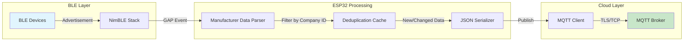
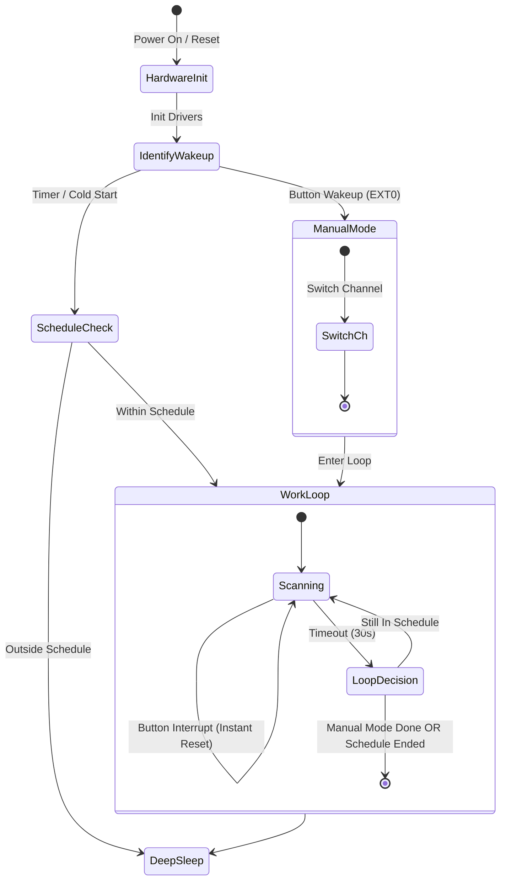

## High-Level Architecture

The gateway bridges BLE devices and MQTT. We scan, deduplicate, and publish.

```mermaid
flowchart LR
    subgraph BLE["BLE Layer"]
        A[BLE Devices] -->|Advertisement| B[NimBLE Stack]
    end
    
    subgraph ESP32["ESP32 Processing"]
        B -->|GAP Event| C[Manufacturer Data Parser]
        C -->|Filter by Company ID| D[Deduplication Cache]
        D -->|New/Changed Data| E[JSON Serializer]
    end
    
    subgraph Cloud["Cloud Layer"]
        E -->|Publish| F[MQTT Client]
        F -->|TLS/TCP| G[MQTT Broker]
    end
    
    style A fill:#e1f5fe
    style G fill:#c8e6c9
```

*   **BLE Stack:** Captures advertisements.
*   **Filter:** Drops anything not matching our Company ID (0xFFFF).
*   **Dedupe:** Caches MACs; only new data gets serialized.
*   **MQTT:** Publishes valid JSON payload.

---

## Core State Machine

The Scanner isn't just a simple loop. It handles deep sleep, manual overrides, and schedule checks.

```mermaid
stateDiagram-v2
    [*] --> HardwareInit: Power On / Reset
    HardwareInit --> IdentifyWakeup: Init Drivers
    
    state IdentifyWakeup <<choice>>
    IdentifyWakeup --> ManualMode: Button Wakeup (EXT0)
    IdentifyWakeup --> ScheduleCheck: Timer / Cold Start

    state ManualMode {
        [*] --> SwitchCh: Switch Channel
        SwitchCh --> [*]
    }
    ManualMode --> WorkLoop: Enter Loop

    state ScheduleCheck <<choice>>
    ScheduleCheck --> WorkLoop: Within Schedule
    ScheduleCheck --> DeepSleep: Outside Schedule

    state WorkLoop {
        [*] --> Scanning
        Scanning --> Scanning: Button Interrupt (Instant Reset)
        Scanning --> LoopDecision: Timeout (30s)
        
        state LoopDecision <<choice>>
        LoopDecision --> Scanning: Still In Schedule
        LoopDecision --> [*]: Manual Mode Done OR Schedule Ended
    }

    WorkLoop --> DeepSleep
```

---

## Key Engineering Decisions

### 1. Interrupt-Driven vs. Polling
We ditched the standard 100ms polling loop. Instead, we use FreeRTOS Task Notifications. The CPU blocks (0% usage) until the GPIO interrupt triggers, giving us microsecond-level response times for channel switching without draining the battery.

### 2. Hybrid Power State Machine
It's not just a simple timer.
*   **In-Schedule:** Continuous scanning loop (no sleep) for real-time data.
*   **Manual Override:** A button press triggers a "One-Shot" 30-second session. It wakes up, captures data, and forces deep sleep immediately to prevent accidental battery drain.

### 3. Smart Deduplication
To save MQTT costs, we cache MAC addresses locally. We only upload *changed* data, not raw noise.

---

## Performance Characteristics

| Metric | Value | Context |
|--------|-------|---------|
| **Button Response** | < 1ms | GPIO ISR + Task Notify |
| **Sleep Current** | ~10µA | ESP32-S3 (ext0 on) |
| **Wakeup Time** | ~300ms | Cold boot to scan start |
| **Latency** | ~50ms | Scan → MQTT Publish |

---

*← [Project Overview](./0.project-overview) | Hardware Design (coming soon) →*
