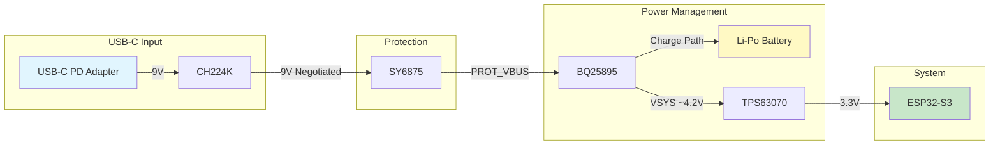
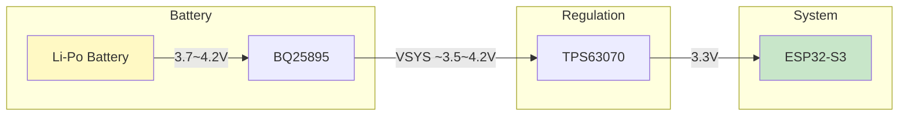

## Architecture

- **TypeC-16P:** Uses a 16pin USB Type-C connector. D+/D- connected to ESP32 for firmware flashing. It also supports PD protocol.
- **CH224K PD Controller:** Communicates with the Type-C CC pins to negotiate and trigger a **9V** output via the PD protocol.
- **SY6875 Input Protection:** Limits the input current to within 3A and disconnects the output in case of overvoltage or undervoltage conditions.
- **BQ25895 Power Management IC:** Manages battery charging and discharging. An I2C interface is implemented, allowing the ESP32 to configure and monitor the BQ25895.
  - When an external power source is present, it powers the ESP32 and charges the battery simultaneously.
  - When external power is absent, the battery supplies power to the ESP32.

- **TPS63070 Buck-Boost Converter:** Regulates the approximately 4.2V output from the power management module down to a stable 3.3V supply for the ESP32. Ensures consistent 3.3V output across varying battery levels, even when the input voltage is close to the target voltage.

- **ESP32-S3:** Receives and processes Bluetooth signals, connects to Wi-Fi, and forwards filtered Bluetooth data to an MQTT server.

---

## Component Selection

The power system is essentially a portable charger with an ESP32 on top. Every chip was chosen to minimize complexity while keeping the prototype safe.

### 1. CH224K PD Controller

We need 9V from a USB-C port. Most PD controllers (e.g., FUSB302, IP2721) require an MCU to run the USB PD protocol stack over I2C. The CH224K eliminates this entirely — voltage selection is hardwired via CFG pins. No firmware, no negotiation state machine, no boot-order dependency.

This also avoids a subtle problem: software-based PD controllers typically start at 5V and then renegotiate up to 9V. That transient voltage step can stress downstream components. The CH224K requests 9V from the very first PD exchange, producing a clean single-step power-on.

*   **No MCU dependency** — pure hardware configuration.
*   **No 5V→9V transient** — requests target voltage on first negotiation.
*   **Low cost** — ideal when the target voltage is fixed and known at design time.

### 2. SY6875 Input Protection

This chip is a **design-for-test** decision. During prototyping, a misconfigured PD negotiation or a wrong adapter could push destructive voltage into the board. The SY6875 provides overvoltage, undervoltage, and overcurrent cutoff — a safety net that protects the entire downstream path.

In a production revision where the PD configuration is validated and locked down, this IC can be removed to save cost and board space.

### 3. BQ25895 Power Management IC

The core requirement is straightforward: charge a single-cell Li-Po (3.7V nominal, 4.2V full) from a 9V input, while simultaneously powering the system without interruption. The BQ25895 handles this with integrated **power path management** — seamless switchover between external power and battery with no output glitch.

*   **Voltage/current match** — supports up to 14V input, configurable charge current, fits the 9V PD + Li-Po topology.
*   **Simple external circuit** — minimal passive components required.
*   **I2C interface** — lets the ESP32 read battery voltage, charge status, and fault flags at runtime, enabling software-level power-aware scheduling.

### 4. TPS63070 Buck-Boost Converter

The VSYS rail from BQ25895 sits at roughly 3.5V–4.2V depending on battery state. The target is 3.3V. Since the input can be *above or below* the output — and the difference can approach zero — a pure buck or pure boost converter cannot work here. A buck-boost topology is mandatory.

The TPS63070 was chosen specifically for its **high efficiency under light load**, which is critical for an IoT device that spends most of its time in deep sleep drawing microamps.

---

## Power Path

The board operates in two distinct modes depending on whether external power is connected.

### Charging Mode (External Power Present)

*   **9V PD** negotiated by CH224K, protected by SY6875, fed into BQ25895.
*   BQ25895 splits the power: one path charges the battery, the other drives VSYS.
*   TPS63070 regulates VSYS down to a stable 3.3V for the ESP32.

### Battery Mode (No External Power)

*   Battery feeds directly through BQ25895's power path to VSYS.
*   TPS63070 buck-boosts the varying battery voltage to a rock-solid 3.3V.
*   The switchover between charging mode and battery mode is **seamless** — BQ25895's integrated power path management ensures zero interruption to the ESP32.

---

## Parameter Design

### 1. Why 9V PD Instead of 5V?

The battery is a 5000mAh single-cell Li-Po charged at 0.5C, requiring a charge current of **2.5A**. On top of that, the ESP32-S3 draws up to ~300mA during peak Wi-Fi TX bursts. The total system demand therefore approaches **2.8A**.

USB PD at 5V is rated for a maximum of 3A — that leaves almost no headroom. Any transient spike could cause the adapter to fold back or the voltage to sag, leading to unstable operation. By stepping up to **9V**, the same 2.8A of power delivery only requires ~1.6A from the adapter (P = V × I), well within the cable and connector ratings. 9V provides comfortable margin without going to 12V or 20V, which would increase switching losses in the BQ25895's internal step-down converter.

### 2. BQ25895 Configuration

**Charge current:** The BQ25895 defaults to 2048mA charge current out of the box, which already satisfies the 0.5C requirement for a 5000mAh cell. For finer control, the ESP32 can write to the charge current register (REG04) over I2C at runtime.

**Input current limit (ILIM pin):** A 130Ω resistor to GND sets the input current limit. Per the datasheet formula:

$$I_{LIM} = \frac{K_{ILIM}}{R_{ILIM}} = \frac{530}{130} \approx 4.08A$$

This provides sufficient headroom above the ~2.8A peak demand while still protecting against fault conditions.

**Temperature sensing bypass (TS pin):** The TS pin expects an NTC thermistor voltage divider to monitor battery temperature. Since this prototype does not include an NTC on the battery pack, we disable the TS function by connecting the REGN output through a **5.1kΩ / 10kΩ** resistor divider to TS. This biases the TS pin to approximately:

$$V_{TS} = V_{REGN} \times \frac{10k}{5.1k + 10k} \approx 0.66 \times V_{REGN}$$

This voltage falls within the "normal temperature" window defined in the datasheet, preventing the charger from entering a false thermal fault state.

**Inductor selection (2.2µH, 5030 package):** The BQ25895 datasheet recommends a 1µH–2.2µH inductor. We chose **2.2µH in a 5030 footprint** — the larger inductance reduces ripple current, and the 5030 package provides a saturation current rating comfortably above the 3A+ peak switch current. A smaller package (e.g., 4020) would risk saturation at full charge current.

### 3. TPS63070 Feedback Resistor Calculation

The TPS63070 regulates its output via an external resistor divider from VOUT to the FB pin. The internal reference voltage is **0.5V**. With R16 = 316kΩ (high-side) and R18 = 100kΩ (low-side):

$$V_{OUT} = V_{REF} \times \left(1 + \frac{R_{16}}{R_{18}}\right) = 0.5 \times \left(1 + \frac{316k}{100k}\right) = 0.5 \times 4.16 = 2.08V$$

Wait — that gives 2.08V, not 3.3V. Checking the TPS63070 datasheet more carefully: the FB reference is actually **0.8V** (typical). Recalculating:

$$V_{OUT} = 0.8 \times \left(1 + \frac{316k}{100k}\right) = 0.8 \times 4.16 \approx 3.33V \checkmark$$

This confirms the 3.3V output target.

**Inductor selection (1µH, 4020 package):** The TPS63070 datasheet recommends 1µH–2.2µH. At the 3.3V / 2A output level, the peak inductor current is moderate enough that a **1µH inductor in a compact 4020 footprint** meets the saturation current requirement while saving board space. The smaller inductance also improves transient response — useful when the ESP32 wakes from deep sleep and current demand jumps from µA to hundreds of mA within microseconds.

---

## PCB Layout Guidelines

A power supply is only as good as its layout. Poor routing can turn a clean schematic into a noisy, inefficient, or even non-functional board.

### 1. Trace Width for High-Current Paths

The primary power path (USB-C → SY6875 → BQ25895 → Battery / VSYS) carries up to **3A**. For a standard 1oz (35µm) copper PCB, the required trace width for 3A with acceptable temperature rise (~10°C) is approximately:

| Current | 1oz Cu Width | 2oz Cu Width |
|---------|-------------|-------------|
| 1A | ~0.3mm | ~0.15mm |
| 2A | ~0.9mm | ~0.45mm |
| 3A | ~1.5mm | ~0.75mm |

In practice, we use **copper pours** (polygon fills) rather than narrow traces for all power rails. This minimizes resistive loss and provides thermal spreading.

### 2. Switching Node Minimization

The **SW pins** of both the BQ25895 and TPS63070 are the highest dV/dt nodes on the board — they swing between GND and VIN at the switching frequency. Large copper area on these nodes acts as an antenna, radiating EMI.

*   Keep the SW node copper area as **small as physically possible** — just enough to connect the IC pin to the inductor pad.
*   Route SW traces short and direct; never fan them out into wide pours.
*   Avoid running sensitive signal traces (I2C, UART) underneath or adjacent to SW nodes.

### 3. Decoupling and Component Placement

High-frequency ceramic decoupling capacitors (typically 0.1µF) must be placed as close to the IC power pins as possible. The goal is to minimize the **current loop area** between the capacitor, the IC, and ground — a smaller loop means lower parasitic inductance and cleaner switching.

*   **Input capacitors** of BQ25895 and TPS63070: place directly adjacent to VIN/PGND pins.
*   **Output capacitors**: place close to VOUT/PGND pins.
*   **Bulk capacitors** (10µF–22µF): can be slightly further away but should still be within a few mm.
*   The **inductor** should sit immediately next to the IC with minimal trace length to the SW and VIN/VOUT pins.

### 4. Ground Vias Strategy

Ground vias serve two distinct purposes in this design, and both are critical:

**Thermal vias** — The BQ25895 has an exposed **PowerPAD** on its underside that must be soldered to a copper pad connected to ground. An array of vias (typically 5–9 vias, 0.3mm drill) under this pad conducts heat to inner or bottom copper layers. Without adequate thermal vias, the IC will throttle or shut down under sustained charging current.

**Return-path vias** — Every high-frequency switching current needs a low-impedance return path. Place ground vias near the GND pins of both switching regulators (BQ25895, TPS63070) to provide a short return loop through the ground plane. This reduces parasitic inductance in the return path, which directly reduces voltage ringing and radiated EMI.

*   Place thermal via arrays under all exposed pads (BQ25895, TPS63070).
*   Place return-path vias adjacent to every PGND pin.
*   Maintain an unbroken ground plane on at least one inner layer — avoid splitting it with signal traces routed through the power section.

---

*← [Software Architecture](./1.software-architecture)*
